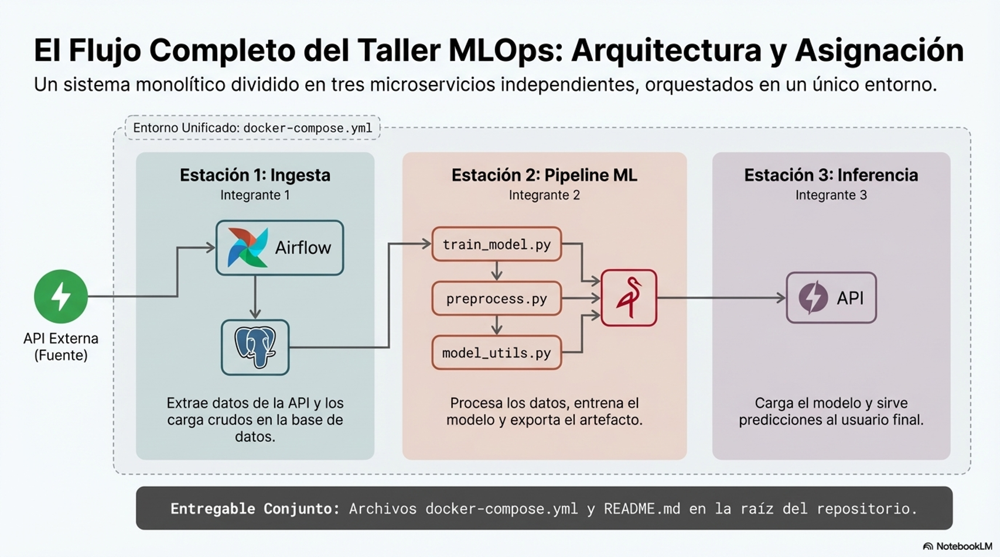
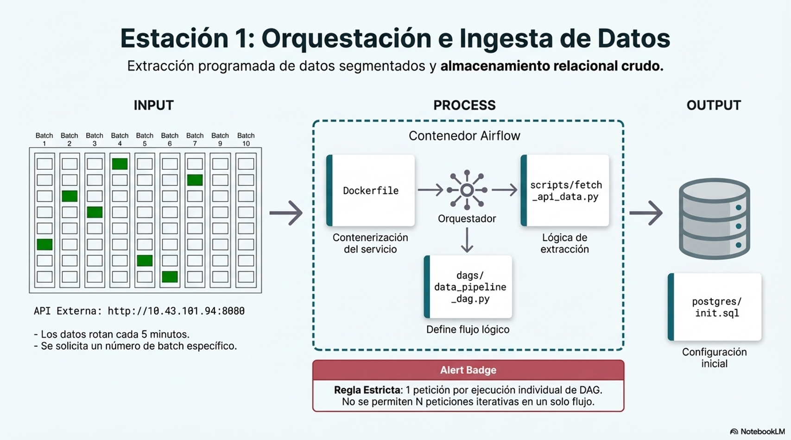
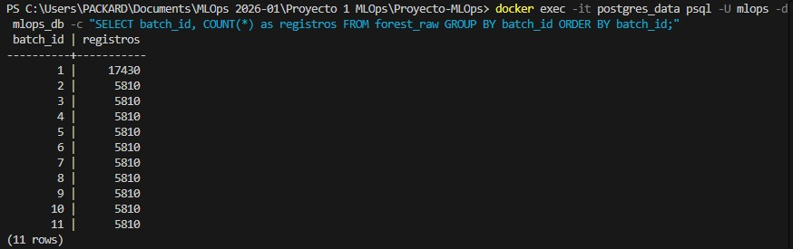
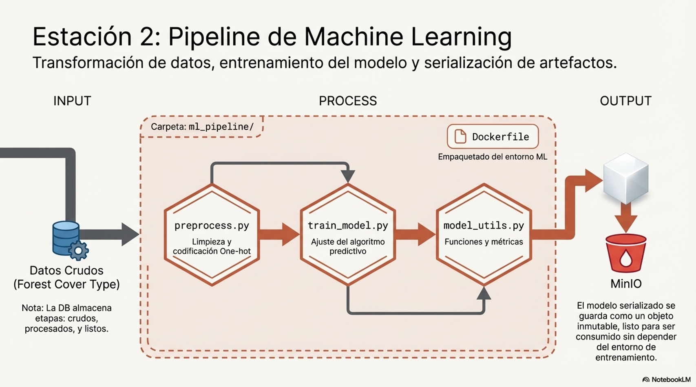
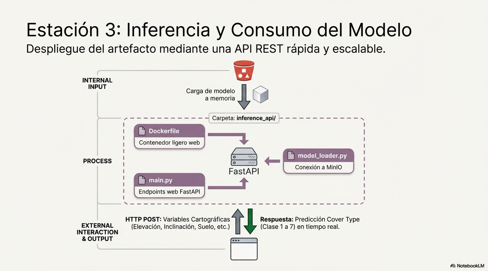

### Proyecto MLOps — Pipeline Completo de Machine Learning
## Descripción

Este proyecto implementa una arquitectura de Machine Learning en producción, basada en microservicios, que cubre todo el ciclo de vida del modelo:

Ingesta de datos
Procesamiento
Entrenamiento
Despliegue
Inferencia

La solución está completamente contenerizada usando Docker Compose, integrando herramientas clave del ecosistema MLOps.

## Contexto del problema

El objetivo del modelo es predecir el tipo de cobertura forestal a partir de variables cartográficas como:

Elevación
Pendiente
Distancias geográficas
Variables categóricas del terreno
Debido a la indisponibilidad de la API original, se implementó una API simulada, garantizando la continuidad del flujo de datos en batches dinámicos.

## Arquitectura del sistema

| Servicio           | Descripción                                     |
| ------------------ | ----------------------------------------------- |
| **Airflow**        | Orquestación del pipeline                       |
| **PostgreSQL**     | Almacenamiento de datos (raw, processed, ready) |
| **MinIO**          | Almacenamiento de modelos                       |
| **Data API**       | Simulación de fuente de datos                   |
| **ML Pipeline**    | Entrenamiento del modelo                        |
| **FastAPI**        | API de inferencia                               |
| **Docker Compose** | Orquestación de contenedores                    |

---

### Flujo de trabajo
1. Llamada a la API
2. Airflow ejecuta un DAG programado. y este realiza la peticion a la API externa (nos toco modelarla en local)
3. Los datos obtenidos se almacenan en PostgreSQL.
4. La base de datos actúa como almacenamiento inicial de datos crudos.
5. ML pipeline
6. MiniO
7. FastAPI
8. Usuario

--- 

El sistema se divide en **tres estaciones principales**.

# Estación 1 — Ingesta y Orquestación de Datos

Este modulo implementa la capa de ingesta de datos del proyecto MLOps. Su responsabilidad es recolectar datos desde una API externa, procesarlos y almacenarlos en PostgreSQL para que el pipeline de entrenamiento pueda consumirlos.

## El flujo es:

API externa (data_api) 
Airflow DAG 
PostgreSQL (forest_raw)
Servicios del docker-compose

El archivo docker-compose.yml levanta los siguientes servicios. Cada uno tiene una responsabilidad especifica dentro del sistema:

- postgres_airflow Base de datos PostgreSQL dedicada exclusivamente a los metadatos internos de Airflow (DAGs, runs, XComs, variables). No almacena datos del proyecto.
- postgres_data Base de datos PostgreSQL donde se almacenan los datos del proyecto en tres etapas: forest_raw (datos crudos de la API), forest_processed (datos con encoding y limpieza) y forest_ready (datos escalados y listos para entrenamiento). El esquema se inicializa automaticamente con postgres/init.sql.
- minio Almacenamiento de objetos compatible con S3. Se utiliza para guardar los modelos entrenados.
- airflow-init Contenedor de inicializacion que crea la base de datos de Airflow y el usuario administrador. Se ejecuta una sola vez y termina.
- airflow-webserver Interfaz grafica de Airflow. Disponible en http://localhost:8080. Permite activar, pausar y monitorear los DAGs.
- airflow-scheduler Componente de Airflow que ejecuta los DAGs segun su programacion. Corre en segundo plano de forma continua.
- data_api Simulacion local de la API del profesor. Sirve porciones aleatorias del dataset Covertype dividido en 11 batches. Expone el puerto 8081 en el host. Esta API se despliega localmente pero Airflow se conecta a ella como si fuera una maquina externa 

Estructura de archivos
airflow/
    dags/
        data_pipeline_dag.py    - DAG de orquestacion
    scripts/
        fetch_api_data.py       - Script de ingesta
    Dockerfile
data_api/
    main.py                     - API local del dataset
    Dockerfile
    data/
        covertype.csv           - Dataset completo (581,012 filas)
postgres/
    init.sql                    - Esquema de las tablas
docker-compose.yml

## Conexion a la API como maquina externa

El enunciado exige que la conexion a la API de datos se realice como si fuera una maquina externa, es decir, no por la red interna de Docker sino via internet o localhost.

Para cumplir este requisito se usa el DNS especial host.docker.internal, que permite a cualquier contenedor Docker acceder al host (la maquina donde corre Docker) como si fuera una IP externa:

Airflow (contenedor)
    - http://host.docker.internal:8081
        - host Windows/Mac
            - puerto 8081
                - contenedor data_api
Esto esta configurado en docker-compose.yml dentro de la seccion x-airflow-common:

## DATA_API_URL: http://host.docker.internal:8081  # Simular red externa
Si se usa la API del profesor en lugar de la local, cambiar esta variable por:

## DATA_API_URL: http://10.43.101.94:8080
Configuracion del tiempo de actualizacion de batches
La API local rota el batch de datos cada cierto tiempo configurable. Este tiempo se controla con la variable MIN_UPDATE_TIME en data_api/main.py:

MIN_UPDATE_TIME = 60  # segundos
Escenario	Valor recomendado
Pruebas locales	60 segundos
API del profesor	300 segundos (5 minutos)
Cuando se cambia MIN_UPDATE_TIME, tambien se debe actualizar el schedule_interval del DAG en airflow/dags/data_pipeline_dag.py para que esten sincronizados:

# Pruebas locales (cada 1 minuto)
schedule_interval="*/1 * * * *"

# API del profesor (cada 5 minutos)
schedule_interval="*/5 * * * *"
DAG: data_pipeline_dag
El DAG orquesta el proceso completo de ingesta. Cada ejecucion realiza exactamente UNA peticion a la API y almacena los registros recibidos en PostgreSQL. No se permiten multiples peticiones por ejecucion.

## Flujo de tareas:

start - fetch_and_store - verify_data - end
fetch_and_store: Llama a la API, convierte los tipos de datos (strings a float/int segun corresponda) y guarda las filas en forest_raw. Si el batch ya existe en la base de datos, omite la insercion para evitar duplicados. Si la API retorna 400 (todos los batches recolectados), termina sin error.

verify_data: Verifica que los datos se guardaron correctamente contando los registros en forest_raw y loggeando el total acumulado.

## Como correr
Requisitos previos
 - Docker Desktop instalado y corriendo
 - El archivo covertype.csv en data_api/data/
 - Levantar todos los servicios
       docker-compose up --build -d
 - Verificar que todo esta corriendo
       docker-compose ps

Todos los servicios deben mostrar running o healthy.

Probar la API local
 - curl "http://localhost:8081/data?group_number=10"
Reiniciar el conteo de batches
 - Si se quiere volver a recolectar desde el batch 1:

curl "http://localhost:8081/restart_data_generation?group_number=10"

## Activar el DAG
- Abrir http://localhost:8080 (usuario: admin, contrasena: admin)
- Activar el toggle del DAG data_pipeline_dag
- Disparar manualmente con el boton Trigger DAG
- Verificar datos en PostgreSQL
  
docker exec -it postgres_data psql -U mlops -d mlops_db \
  -c "SELECT batch_id, COUNT(*) as registros FROM forest_raw GROUP BY batch_id ORDER BY batch_id;"
  
Pausar el DAG cuando se tengan los 10 batches
docker exec -it airflow_scheduler airflow dags pause data_pipeline_dag
Interfaces graficas
Servicio	URL	Usuario	Contrasena
Airflow	http://localhost:8080	admin	admin
MinIO	http://localhost:9001	minioadmin	minioadmin
Data API (Swagger)	http://localhost:8081/docs	-	-

Resultado

---

# Estación 2 — Pipeline de Machine Learning

Esta estación implementa el pipeline de entrenamiento del modelo de Machine Learning, encargado de transformar los datos, entrenar el modelo y almacenar el artefacto resultante en un sistema de almacenamiento desacoplado.

El pipeline se ejecuta dentro de un contenedor Docker (ml_pipeline) y forma parte del flujo MLOps del proyecto.

## Arquitectura del Sistema

El sistema está compuesto por los siguientes servicios:

## Flujo del Pipeline

El pipeline es completamente automatizado:

- Lectura de datos desde  PostgreSQL
- Procesamiento de datos   
- Entrenamiento del modelo  
- Evaluación del modelo  
- Almacenamiento del modelo en MinIO  

## Modelo

Algoritmo: RandomForestClassifier

Parámetros:
n_estimators=200
random_state=42

## Evaluación

Accuracy
Precision
Recall
F1-score

## Almacenamiento

Archivo: forest_model.joblib
Bucket: models (MinIO)

## Decisiones de diseño

Separación entre datos (PostgreSQL) y modelos (MinIO)
Pipeline desacoplado del sistema de inferencia
Reproducibilidad mediante Docker

---

# Estación 3 — API de Inferencia

Esta estación se encarga de **servir predicciones utilizando el modelo entrenado**.

El modelo se carga desde MinIO y se expone a través de una **API REST implementada con FastAPI**.

### Flujo de trabajo

1. El servicio descarga el modelo desde MinIO.
2. El modelo se carga en memoria.
3. La API recibe variables de entrada.
4. Se genera una predicción en tiempo real.

### Componentes principales

Carpeta:

inference_api/

Archivos principales:

main.py
model_loader.py
Dockerfile

### API REST

Endpoint principal:
POST /predict

Entrada esperada:
Variables cartográficas como:

- Elevation
- Slope
- Soil_Type
- Hillshade
- Distancias geográficas

Salida:
Predicción de Cover Type (clase 1 a 7)

---

# Integración del sistema

Todos los servicios se ejecutan dentro de un entorno unificado utilizando:

docker-compose.yml

Esto permite simular una arquitectura completa de **Machine Learning en producción**.

---

# Flujo completo del sistema

API externa - Airflow (ingesta) - PostgreSQL - ML Pipeline (entrenamiento) - MinIO (almacenamiento del modelo) - FastAPI (inferencia) Usuario final

---

# Tecnologías utilizadas

- Python
- Docker
- Docker Compose
- Apache Airflow
- PostgreSQL
- MinIO
- FastAPI
- Scikit-learn

---

## Conclusión

Se construyó un sistema completo de MLOps que automatiza el flujo desde datos hasta predicciones en producción.
La solución es reproducible, escalable y alineada con prácticas reales de la industria.

# Autores

Proyecto desarrollado para la asignatura **MLOps**.
Arquitectura basada en microservicios para el ciclo completo de Machine Learning.
